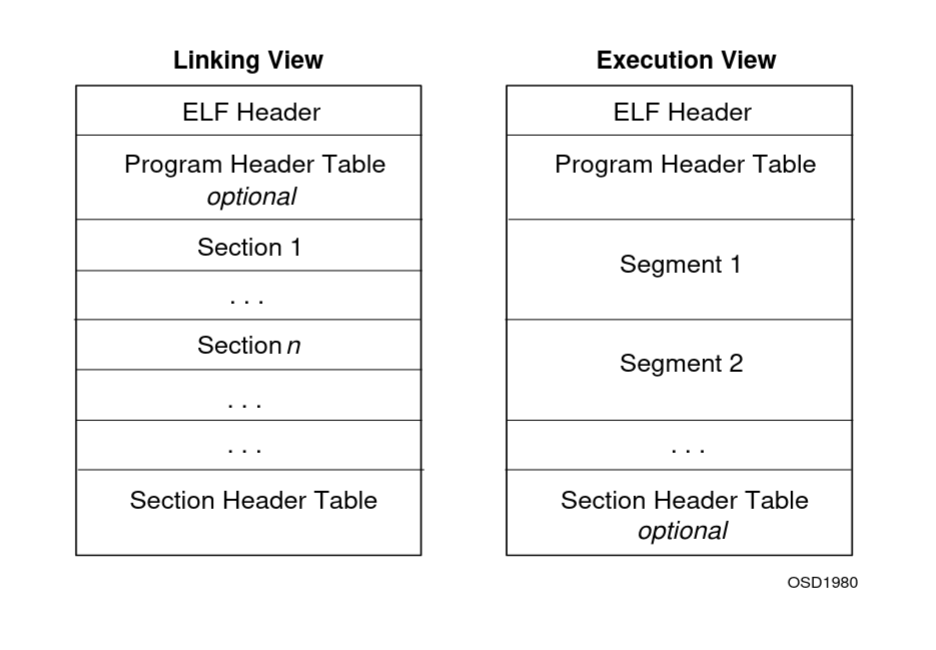
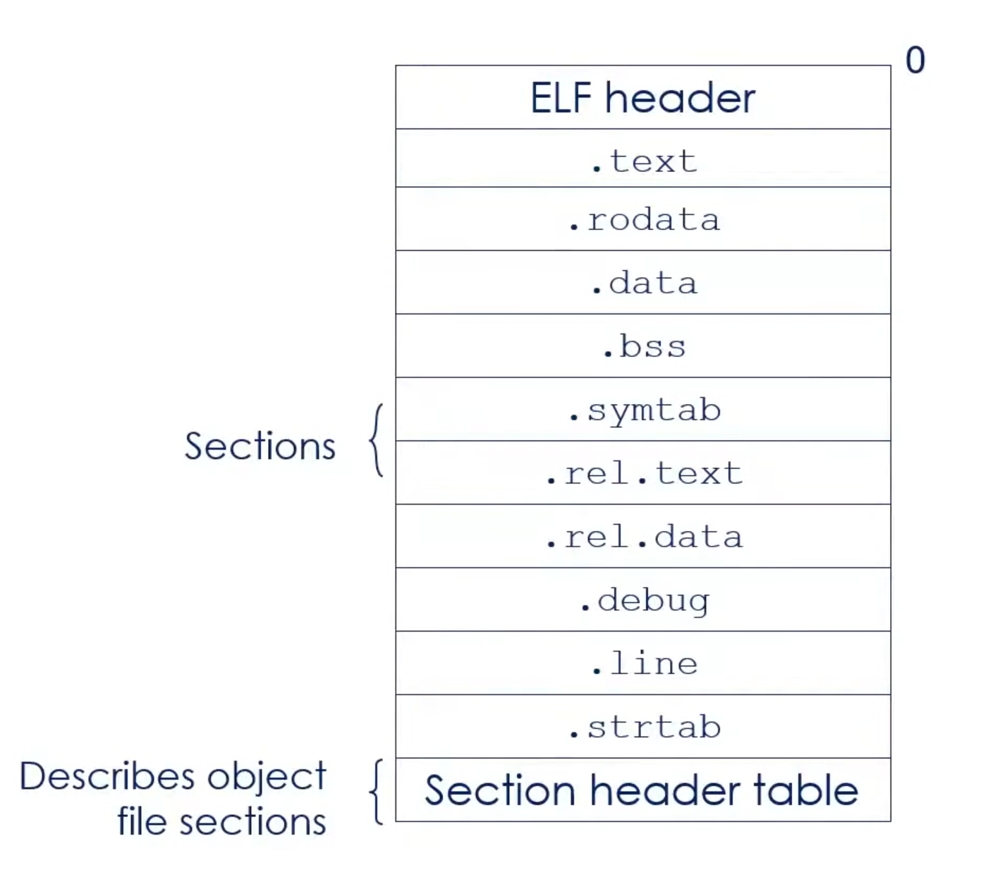

# ELF

## Содержание

- [Ресурсы](#Ресурсы)
- [Основные сущности](#Основные-сущности)
- [Различие сегментов и секций](#Различие-сегментов-и-секций)
- [Заголовок `ELF`](#Заголовок-ELF)
- [Заголовки секций](#Заголовки-секций)
- [Заголовки сегментов (заголовки программ)](#Заголовки-сегментов-заголовки-программ)
    - [Структура `Program Header`'а](#Структура-Program-Headerа)
- [Символы](#Символы)
- [Линковка](#Линковка)

## Ресурсы

1) [Подробное видео на тему](https://youtu.be/nC1U1LJQL8o?si=a_rvF1k9vZImVYbV)
2) [Статья по структурам `ELF`](https://tmpout.sh/4/12.html)
3) [Исходный код описания структур из ядра](https://elixir.bootlin.com/linux/v6.18.6/source/include/uapi/linux/elf.h)
4) [man-страница](https://man7.org/linux/man-pages/man5/elf.5.html)
5) [Спецификация `ELF`](https://refspecs.linuxfoundation.org/elf/elf.pdf)
6) [Курс CS 361 (в начале есть полезные видео по символам, ELF, линковке, PIC, GOT, PLT и т.д.)](https://youtube.com/playlist?list=PLhy9gU5W1fvUND_5mdpbNVHC1WCIaABbP&si=sNfhM18q1MtCw_a6)
7) [Статья `Linkers and Loaders`](https://www.linuxjournal.com/article/6463)
8) [Глава 7 из книги `Computer Systems: A Programmer's Perspective`](https://www.cs.sfu.ca/~ashriram/Courses/CS295/assets/books/CSAPP_2016.pdf)

## Основные сущности

Двумя основными сущностями, содержащимися в `ELF`-файле являются:
1) Сегменты (segments)
2) Секции (sections)

Каждый `ELF` может содержать 0 или более сегментов и 0 или более секций. Несмотря на то, что эти два слова являются синонимичными, в контексте `ELF` это 2 совершенно разных понятия.

Сегменты используются в `run-time`, секции - при линковке (`link-time`).



Как сегменты, так и секции указывают на абсолютный адрес внутри `ELF`-файла и описывают, сколько байт содержат внутри себя. Также, существуют сегменты, не содержащие никакого контента вовсе.


## Различие сегментов и секций

Главное отличие сегмента от секции заключается в том, что сегменты описывают, где и как они должны быть загружены в виртуальную или физическую память: то есть, сегменты сообщают ОС, как она должна замапить части `ELF` в память.

## Заголовок `ELF`

```c
typedef struct {
    unsigned char e_ident[16]; /*  ELF identification */
    Elf64_Half e_type;         /*  Object file type */
    Elf64_Half e_machine;      /*  Machine type */
    Elf64_Word e_version;      /*  Object file version */
    Elf64_Addr e_entry;        /*  Entry point address */
    Elf64_Off  e_phoff;        /*  Program header offset */
    Elf64_Off  e_shoff;        /*  Section header offset */
    Elf64_Word e_flags;        /*  Processor-specific flags */
    Elf64_Half e_ehsize;       /*  ELF header size */
    Elf64_Half e_phentsize;    /*  Size of program header entry */
    Elf64_Half e_phnum;        /*  Number of program header entries */
    Elf64_Half e_shentsize;    /*  Size of section header entry */
    Elf64_Half e_shnum;        /*  Number of section header entries */
    Elf64_Half e_shstrndx;     /*  Section name string table index */
} Elf64_Ehdr
```

`e_entry` содержит виртуальный адрес точки входа в программу (метки `_start`). Для `no-pie` бинарников адрес чётко определён. Для `pie` здесь будет содержаться сдвиг относительно начала секции `.text`. `PIE` - позиционно-независимый, `no PIE` - позиционно-зависимый

`e_type` определяет тип `ELF`-файла:
0) `ET_NONE`: неизвестный тип
1) `ET_REL`: перемещаемый (`relocatable`) файл
2) `ET_EXEC`: исполняемый файл (не `PIE`)
3) `ET_DYN`: исполняемый файл или разделяемый объект (`PIE`)
4) `ET_CORE`: файл ядра

## Заголовки секций

Разделы кода и данных, из которых состоит программа. Внутри `ELF`'а описывающие структуры секций находятся в массиве друг за другом, их смещение в файле определяет поле `e_shoff`, размер - `e_shentsize`, количество - `e_shnum`. В выводе `readelf -h` обозначены как `section headers`.

Секции используются во время линковки, во время исполнения не обязательны. Во время исполнения секции в основном нужны линковщику и инструментам отладки.

Структура, описывающая заголовок секции:
```c
typedef struct {
    uint32_t   sh_name;
    uint32_t   sh_type;
    uint64_t   sh_flags;
    Elf64_Addr sh_addr;
    Elf64_Off  sh_offset;
    uint64_t   sh_size;
    uint32_t   sh_link;
    uint32_t   sh_info;
    uint64_t   sh_addralign;
    uint64_t   sh_entsize;
} Elf64_Shdr;
```

`sh_name` - не строка, а сдвиг внутри таблицы строк секций (`section header string table`). Эта таблица адресуема по сдвигу `e_shstrndx` (поле заголовка `ELF`): он описывает индекс секции, в которой хранится таблица. Она содержит NULL-терминированные строки. Пример:
```
E  x  a  m  p  l  e     T  a  b  l  e
45 78 61 6d 70 6c 65 00 54 61 62 6c 65 00
```

`Example` имеет сдвиг 0, `Table` - сдвиг 8.

`sh_type` описывает тип секции. Ниже несколько (не все):
```
SHT_NULL            - 0
    This value marks the section header as inactive. It
    does not have an associated section. Other members
    of the section header have undefined values.

SHT_PROGBITS        - 1
    This section holds information defined by the
    program, whose format and meaning are determined
    solely by the program.

SHT_SYMTAB          - 2
    This section holds a symbol table. Typically,
    SHT_SYMTAB provides symbols for link editing, though
    it may also be used for dynamic linking. As a
    complete symbol table, it may contain many symbols
    unnecessary for dynamic linking. An object file can
    also contain a SHT_DYNSYM section. The index of the
    associated string table section can be found in the
    sh_link member.

SHT_STRTAB          - 3
    This section holds a string table. An object file
    may have multiple string table sections.

SHT_RELA            - 4
    This section holds relocation entries with explicit
    addends, such as type Elf32_Rela for the 32-bit
    class of object files. An object may have multiple
    relocation sections.

SHT_HASH            - 5
    This section holds a symbol hash table. An object
    participating in dynamic linking must contain a
    symbol hash table. An object file may have only one
    hash table.

SHT_DYNAMIC         - 6
    This section holds information for dynamic linking.
    An object file may have only one dynamic section.

SHT_NOTE            - 7
    This section holds notes (ElfN_Nhdr).

SHT_NOBITS          - 8
    A section of this type occupies no space in the file
    but otherwise resembles SHT_PROGBITS. Although this
    section contains no bytes, the sh_offset member
    contains the conceptual file offset.

SHT_REL             - 9
    This section holds relocation offsets without
    explicit addends, such as type Elf32_Rel for the
    32-bit class of object files. An object file may
    have multiple relocation sections.

SHT_SHLIB           - 10
    This section is reserved but has unspecified
    semantics.

SHT_DYNSYM          - 11
    This section holds a minimal set of dynamic linking
    symbols. An object file can also contain a
    SHT_SYMTAB section.
```

`sh_flags` описывает флаги:
- `SHF_WRITE`: эта секция может быть записываемой, если из неё создаётся сегмент
- `SHF_ALLOC`: эта секция должна быть частью сегментов, которые загружаются в память
- `SHF_EXECINSTR`: эта секция содержит исполняемый код

`sh_addr` содержит адрес, на котором секция будет находиться в памяти процесса. Если секция не должна загружаться в память, то поле будет равно 0

`sh_offset` содержит сдвиг в `ELF`-файле, определяющий начало данных секции

`sh_size` содержит размер данных секции

`sh_link` позволяет секции быть слинкованной с другой секцией (?)

> This member holds a section header table index link, whose interpretation depends on the section type

`sh_info` содержит дополнительную информацию, интерпретация зависит от типа секции

`sh_addralign` определяет ограничения на выравнивание секции

`sh_entsize` используется для некоторых секций, содержащих таблицы с записями фиксированного размера. Хранит размер одной такой записи

> Some sections hold a table of fixed-sized entries, such as a symbol table. For such a section, this member gives the size in bytes for each entry. This member contains zero if the section does not hold a table of fixed-size entries.

После этапа компоновки все эти поля не имеют более никакой ценности, поэтому присутствие раздела заголовков секций внутри исполняемого файла не является обязательным

### Типы секций



Подробное объяснение того, что содержит каждая из секций, будет дано в [разделе про символы](#разбиение-на-секции), потому что на данный момент недостаточно понятно, какие **конкретно** символы будут размещаться в каждой из секций

### Пример вывода различных типов секций

Рассмотрим следующую программу (`static-example.c`):

```c
#include <stdio.h>

__attribute__((weak)) int ten_func() {
    return 10;
};

int not_defined_here;
char message[] = "hello_world";
static int invocations = 0;

void hello_world(int increment) {
    int some_var;
    int some_var_defined = 2;
    static int first_time = 0;
    if (increment >= 0) {
        puts(message);
        invocations++;
        fprintf(stderr, "I have printed to the screen %d times.\n", invocations);

        hello_world(increment - 1);
    }

    if (first_time == 0) {
        fprintf(stderr, "this is the end of the first invocation of hello_world\n");
        first_time++;
    }
}

int main() {
    hello_world(3);
}
```

Скомпилируем с флагом `-c` (только компиляция):
```sh
$ gcc -c static-example.c
```

Выведем список секций и их содержимое с помощью утилиты `readelf` (`.o` также являются `ELF`-файлами), воспользовавшись флагом `-S`:

```sh
$ readelf -S static-example.o
There are 14 section headers, starting at offset 0x680:

Section Headers:
  [Nr] Name              Type             Address           Offset
       Size              EntSize          Flags  Link  Info  Align
  [ 0]                   NULL             0000000000000000  00000000
       0000000000000000  0000000000000000           0     0     0
  [ 1] .text             PROGBITS         0000000000000000  00000040
       00000000000000c3  0000000000000000  AX       0     0     1
  [ 2] .rela.text        RELA             0000000000000000  00000440
       0000000000000180  0000000000000018   I      11     1     8
  [ 3] .data             PROGBITS         0000000000000000  00000108
       000000000000000c  0000000000000000  WA       0     0     8
  [ 4] .bss              NOBITS           0000000000000000  00000114
       000000000000000c  0000000000000000  WA       0     0     4
  [ 5] .rodata           PROGBITS         0000000000000000  00000118
       0000000000000060  0000000000000000   A       0     0     8
  [ 6] .comment          PROGBITS         0000000000000000  00000178
       000000000000001c  0000000000000001  MS       0     0     1
  [ 7] .note.GNU-stack   PROGBITS         0000000000000000  00000194
       0000000000000000  0000000000000000           0     0     1
  [ 8] .note.gnu.pr[...] NOTE             0000000000000000  00000198
       0000000000000030  0000000000000000   A       0     0     8
  [ 9] .eh_frame         PROGBITS         0000000000000000  000001c8
       0000000000000078  0000000000000000   A       0     0     8
  [10] .rela.eh_frame    RELA             0000000000000000  000005c0
       0000000000000048  0000000000000018   I      11     9     8
  [11] .symtab           SYMTAB           0000000000000000  00000240
       0000000000000180  0000000000000018          12     7     8
  [12] .strtab           STRTAB           0000000000000000  000003c0
       0000000000000079  0000000000000000           0     0     1
  [13] .shstrtab         STRTAB           0000000000000000  00000608
       0000000000000074  0000000000000000           0     0     1
Key to Flags:
  W (write), A (alloc), X (execute), M (merge), S (strings), I (info),
  L (link order), O (extra OS processing required), G (group), T (TLS),
  C (compressed), x (unknown), o (OS specific), E (exclude),
  D (mbind), l (large), p (processor specific)
```

В выводе видны наименования показанных ранее секций. Их подробное описание будет [позже](#разбиение-на-секции)

### Дополнительно

Получить описание секций можно с помощью вызова программы `readelf` с флагами `--sections/-S` или `objdump` с флагом `-s`

## Заголовки сегментов (заголовки программ)

Содержат информацию о сегментах, которые необходимо загрузить в память. Находятся сразу же после `ELF`-заголовка. Каждый сегмент определён заголовком `Program Header`. Все эти `PH`'ы идут подряд внутри `ELF`, поле `e_phoff` содержит сдвиг начала этого массива `PH` внутри `ELF`. Полу `e_phentsize` определяет размер одного такого `PH`, `e_phnum` - их количество. В выводе `readelf -h` обозначены как `program headers`.


### Структура `Program Header`'а

```c
typedef struct {
    uint32_t   p_type;
    uint32_t   p_flags;
    Elf64_Off  p_offset;
    Elf64_Addr p_vaddr;
    Elf64_Addr p_paddr;
    uint64_t   p_filesz;
    uint64_t   p_memsz;
    uint64_t   p_align;
} Elf64_Phdr;
```

Важным полем является `p_type`, описывающий тип сегмента. Этих типов всего 8:
```
PT_NULL         - 0 - PLACE HOLDER
PT_LOAD         - 1 - LOADABLE SEGMENT
PT_DYNAMIC      - 2 - INFO FOR DYNAMIC LINKING
PT_INTERP       - 3 - LOCATION OF INTERPRETER
PT_NOTE         - 4 - METADATA
PT_PHDR         - 6 - LOCATION OF PROGRAM HEADER TABLE IN MEMORY
PT_TLS          - 7 - THREAD LOCAL STORAGE INFORMATION
```

Касательно `PT_INTERP`: обычно есть у динамически линкуемых исполняемых файлов, у `shared libraries` его обычно нет.

`p_offset` содержит смещение сегмента относительно начала самого `ELF`

`p_vaddr` содержит виртуальный адрес, по которому должен находиться первый байт сегмента в памяти
  
`p_paddr` содержит тот же самый адрес, но физический (к примеру, используется в прошивках)

`p_filesz` и `p_memsz` определяют размер сегмента в бинарнике `ELF` и в памяти соответственно

`p_flags` определяет права для сегмента (комбинация `R/W/E`)

`p_align` определяет выравнивание

Получить описание сегментов можно с помощью вызова программы `readelf` с флагами `--segments/-l`.

## Символы

Воспользуемся утилитой `readelf` для чтения символов перемещаемого бинарного файла (объектника) из [примера](#пример):

```sh
$ readelf -sh static-example.o
ELF Header:
  Magic:   7f 45 4c 46 02 01 01 00 00 00 00 00 00 00 00 00
  Class:                             ELF64
  Data:                              2's complement, little endian
  Version:                           1 (current)
  OS/ABI:                            UNIX - System V
  ABI Version:                       0
  Type:                              REL (Relocatable file)
  Machine:                           Advanced Micro Devices X86-64
  Version:                           0x1
  Entry point address:               0x0
  Start of program headers:          0 (bytes into file)
  Start of section headers:          1664 (bytes into file)
  Flags:                             0x0
  Size of this header:               64 (bytes)
  Size of program headers:           0 (bytes)
  Number of program headers:         0
  Size of section headers:           64 (bytes)
  Number of section headers:         14
  Section header string table index: 13

Symbol table '.symtab' contains 16 entries:
   Num:    Value          Size Type    Bind   Vis      Ndx Name
     0: 0000000000000000     0 NOTYPE  LOCAL  DEFAULT  UND 
     1: 0000000000000000     0 FILE    LOCAL  DEFAULT  ABS static-example.c
     2: 0000000000000000     0 SECTION LOCAL  DEFAULT    1 .text
     3: 0000000000000000     0 SECTION LOCAL  DEFAULT    4 .bss
     4: 0000000000000004     4 OBJECT  LOCAL  DEFAULT    4 invocations
     5: 0000000000000000     0 SECTION LOCAL  DEFAULT    5 .rodata
     6: 0000000000000008     4 OBJECT  LOCAL  DEFAULT    4 first_time.0
     7: 0000000000000000    11 FUNC    WEAK   DEFAULT    1 ten_func
     8: 0000000000000000     4 OBJECT  GLOBAL DEFAULT    4 not_defined_here
     9: 0000000000000000    12 OBJECT  GLOBAL DEFAULT    3 message
    10: 000000000000000b   163 FUNC    GLOBAL DEFAULT    1 hello_world
    11: 0000000000000000     0 NOTYPE  GLOBAL DEFAULT  UND puts
    12: 0000000000000000     0 NOTYPE  GLOBAL DEFAULT  UND stderr
    13: 0000000000000000     0 NOTYPE  GLOBAL DEFAULT  UND fprintf
    14: 0000000000000000     0 NOTYPE  GLOBAL DEFAULT  UND fwrite
    15: 00000000000000ae    21 FUNC    GLOBAL DEFAULT    1 main
```

Эти же символы можно прочитать ещё и с помощью утилиты `nm`:

```sh
$ nm static-example.o
0000000000000008 b first_time.0
                 U fprintf
                 U fwrite
000000000000000b T hello_world
0000000000000004 b invocations
00000000000000ae T main
0000000000000000 D message
0000000000000000 B not_defined_here
                 U puts
                 U stderr
0000000000000000 W ten_func
```

Те же самые символы, что в выводе `readelf -s`. Здесь второй столбец показывает секцию, в которую попадёт символ: `T` - в секцию `.text`, `D` - в `.data`, `B` - в `.bss`, левый столбец - сдвиг относительно начала секции, правый - название символа. Подробнее про секции [дальше](#разбиение-на-секции)

Определим, что такое символ. Символ - это запись в таблице символов (ого) `ELF`, описывающая именованный объект (функции/данные/секции/файлы), которая должна быть обработана линковщиком.

### Структура символа

```c
typedef struct elf32_sym {
  Elf32_Word	st_name;
  Elf32_Addr	st_value;
  Elf32_Word	st_size;
  unsigned char	st_info;
  unsigned char	st_other;
  Elf32_Half	st_shndx;
} Elf32_Sym;

typedef struct elf64_sym {
  Elf64_Word st_name;		/* Symbol name, index in string tbl */
  unsigned char	st_info;	/* Type and binding attributes */
  unsigned char	st_other;	/* No defined meaning, 0 */
  Elf64_Half st_shndx;		/* Associated section index */
  Elf64_Addr st_value;		/* Value of the symbol */
  Elf64_Xword st_size;		/* Associated symbol size */
} Elf64_Sym;
```

`st_name` содержит индекс имени символа в таблице строк символов. Колонка `Name` в выводе `readelf --symbols <elf>`

`st_info` содержит тип символа и его биндинг. Колонки `Type` и `Bind` соответственно в выводе `readelf --symbols <elf>`

`st_other` сейчас не имеет определённого значения, раньше определял видимость. Колонка `Vis` в выводе `readelf --symbols <elf>`

`st_shndx` содержит индекс секции, к которой относится символ (колонка `[Nr]` в выводе `readelf --sections <elf>`). Также, существуют некоторые специальные значения индексов (`UND`, `COM`, `ABS` и другие): эти символы пока не принадлежат ни одной из секций и будут размещены в псевдосекции. Колонка `Ndx` в выводе `readelf --symbols <elf>`

`st_value` содержит значение символа (разное для разных типов `ELF`. К примеру, для `REL` значение - сдвиг относительно начала секции). Колонка `Value` в выводе `readelf --symbols <elf>`

`st_size` содержит размер символа. Колонка `Size` в выводе `readelf --symbols <elf>`

### Разбиение символов по виду локальности (биндинг)

Символы можно разделить на 4 типа: ***локальные***, ***глобальные***, ***внешние (определённые извне)***, ***слабые***. 3 из этих типов соответственно обозначаются через `STB_LOCAL`, `STB_GLOBAL`, `STB_WEAK`. Внешние символы помечаются как `STB_GLOBAL` + `UND` (~`undefined`) (колонка `Ndx`). Разделим символы из вышеприведённого `ELF` на эти типы:

1) Локальные: статические (`invocations`, `first_time`)
2) Глобальные: `message`
3) Внешние (определённые извне): `puts`, `stderr`, `fprintf`, `fwrite`
4) Слабые (`weak`): `ten_func`

Про ***локальные***, ***глобальные*** и ***внешние*** символы подробнее будет в разделе о [линковке](#линковка)

Для понимания ***слабых*** символов нужно ввести понятие ***сильного*** символа. ***Сильный символ*** - инициализированный символ (грубо говоря). То есть, определённый однозначно. Его повторное определение приведёт к ошибке линковки. В целом, эти понятия определяются на уровне компиляции и линковки, не на уровне стандарта языка. ***Слабый символ*** можно определять повторно. Один из способов пометки символа как ***слабого*** является указания аттрибута `__attribute((weak))`, что и было продемонстрировано в примере `static-example.c`. Пометка символа слабым нужна, к примеру, для определения стандартного поведения, если не определено иное. 

Разберём 3 случая разрешения символа:
1) Линкер находит среди `.o`-файлов 2 сильных определения символа. В таком случае, будет возвращена ошибка
2) Линкер находит среди `.o`-файлов 1 сильное определение и 1 слабое. Будет выбрано сильное определение
3) Линкер находит среди `.o`-файлов лишь несколько слабых определений. Будет выбрано одно из слабых определений. Какое, зависит от линковщика - стандарт языка этого не определяет 


**Важно**: переменная `increment` символом не является! Также не являются символами переменные `some_var` и `some_var_defined`. Работа с ними происходит через стек, поэтому изменяется лишь секция `.text`, линковщику не придётся совершать работу по разрешению этих символов

В английских источниках можно встретить понятие `ELF Binding`. Это и есть разбиение по виду локальности

### Разбиение на секции

Возвращаемся к секциям. Все символы будут размещены в какие-то из секций.

Продублирую картинку:


[Ранее](#пример-вывода-различных-типов-секций) был показан пример чтения `ELF`-файла и вывода секций через `readelf`. С помощью `objdump` можно вывести дамп каждой конкретной секции и посмотреть её содержимое

```sh
$ objdump -s static-example.o
static-example.o:     file format elf64-x86-64

Contents of section .text:
 0000 554889e5 4883ec20 897decc7 45fc0200  UH..H.. .}..E...
 0010 0000837d ec00784f 488d0500 00000048  ...}..xOH......H
 0020 89c7e800 0000008b 05000000 0083c001  ................
 0030 89050000 00008b15 00000000 488b0500  ............H...
 0040 00000048 8d0d0000 00004889 ce4889c7  ...H......H..H..
 0050 b8000000 00e80000 00008b45 ec83e801  ...........E....
 0060 89c7e800 0000008b 05000000 0085c075  ...............u
 0070 2f488b05 00000000 488d3d00 00000048  /H......H.=....H
 0080 89c1ba37 000000be 01000000 e8000000  ...7............
 0090 008b0500 00000083 c0018905 00000000  ................
 00a0 90c9c355 4889e5bf 03000000 e8000000  ...UH...........
 00b0 00b80000 00005dc3                    ......].
Contents of section .data:
 0000 68656c6c 6f5f776f 726c6400           hello_world.
Contents of section .rodata:
 0000 49206861 76652070 72696e74 65642074  I have printed t
 0010 6f207468 65207363 7265656e 20256420  o the screen %d
 0020 74696d65 732e0a00 74686973 20697320  times...this is
 0030 74686520 656e6420 6f662074 68652066  the end of the f
 0040 69727374 20696e76 6f636174 696f6e20  irst invocation
 0050 6f662068 656c6c6f 5f776f72 6c640a00  of hello_world..
Contents of section .comment:
 0000 00474343 3a202847 4e552920 31352e32  .GCC: (GNU) 15.2
 0010 2e312032 30323630 31303300           .1 20260103.
Contents of section .note.gnu.property:
 0000 04000000 20000000 05000000 474e5500  .... .......GNU.
 0010 020001c0 04000000 01000000 00000000  ................
 0020 010001c0 04000000 01000000 00000000  ................
Contents of section .eh_frame:
 0000 14000000 00000000 017a5200 01781001  .........zR..x..
 0010 1b0c0708 90010000 1c000000 1c000000  ................
 0020 00000000 a3000000 00410e10 8602430d  .........A....C.
 0030 06029e0c 07080000 1c000000 3c000000  ............<...
 0040 00000000 15000000 00410e10 8602430d  .........A....C.
 0050 06500c07 08000000                    .P......
```

- `.text`: машинные инструкции (исполняемый код)
- `.rodata`: `read-only data` - глобальные символы, доступные только для чтения
- `.data`: `read-write data` - глобальные символы, доступные как для чтения, так и для записи
- `.bss`: `block starting symbol` (j4f: `better save size`) содержит информацию о данных, о которых на момент запуска программы известно, что они будут иметь значение `0`. В бинарнике не хранятся значения `0`, лишь количество байт, которые необходимо заполнить в памяти нулями. К примеру, если в программе есть буфер размера 4096 байт, в `ELF` будет храниться количество байт буфера, память будет проинициализирована нулями лишь в момент загрузки программы.
- `.symtab`: информация о символах, выше изображена в человеко-читаемом формате (можно получить через `readelf -s ...`)
- `.rel.text` & `.rel.data`: `TODO` для линковщика - глобальные внешние символы (`eventually` будут находиться в секциях `.text` или `.data` соответственно, но пока их здесь нет)
- `.debug`: различные переменные компилятора (информация для отладки)
- `.line`: отображение ассемблерных инструкций из `.text` на `C`-код (информация для отладки)
- `.strtab`: соответствие вхождений в таблицу символов их человеко-читаемым символам

### Про `common`-символы

1) Сильные (`strong symbols`): инициализированные символы (было уже введено ранее)
2) Обычные (`common symbols`): неинициализированные символы, хинт (директива) линковщику: во время своей работы он может встретить несколько объявлений этого символы разных размерностей (к примеру, 4 байта или 1 байт (`uint32_t` или `uint8_t`)). Линковщик разместит все символы по одному и тому же месту в памяти и выделит место, равное символу наибольшей размерности (если рассматривать пример, то это будет `uint32_t`). В английских источниках можно встретить название `tentative definitions`

#### Пример c `common symbol`

`commonlib.c` содержит обычное определение `x` и сильное определение `f()`:

```c
int x;

void f() {
    x = 0x3b29;
}
```

`commonmain.c` содержит обычное определение `f()` и сильные определения `x` и `y`:

```c
#include <stdio.h>

void f();

char x = 'a';
char y = 'b';

int main() {
    f();
    printf("%c%c\n", y, x);
    return 0;
}
```

```Makefile
CC=gcc
FLAGS=-g -fno-pie -no-pie -fcommon

%.o: %.c
	$(CC) $(FLAGS) -c -o $@ $<

commonsymbols: commonmain.o commonlib.o
	$(CC) $(FLAGS) -o $@ $^

clean:
	rm -f commonlib.o commonmain.o a.out commonsymbols
```

Соберём `commmonsymbols`:

```sh
make commonsymbols
```

И запустим `commonsymbols`. Каким будет вывод? Вот таким:

```
;)
```

Почему так?

> Modern versions of gcc (starting with 10.1) default to "-fno-common" which means uninitialized global variables are placed in the `.bss` section instead of the common section so they are considered "strong symbols" instead of "common" and will produce multiple definition errors. To bypass, specify the "-fcommon" option in the command

<details>

<summary>Подробнее про `-fno-common`</summary>

Рассмотрим пример:

```sh
$ echo 'int x;' > a.c
$ gcc -S -fno-common a.c
$ cat a.s
        .file   "a.c"
        .text
        .globl  x
        .bss
        .align 4
        .type   x, @object
        .size   x, 4
x:
        .zero   4
        .ident  "GCC: (GNU) 15.2.1 20260103"
        .section        .note.GNU-stack,"",@progbits
```

С флагом `-fno-common` (стандартным для последних версий `GCC`) `x` попал в секцию `.bss`

Соберём с флагом `-fcommon`:

```sh
$ gcc -S -fcommon a.c
$ cat a.s
        .file   "a.c"
        .text
        .comm   x,4,4
        .ident  "GCC: (GNU) 15.2.1 20260103"
        .section        .note.GNU-stack,"",@progbits
```

В какую секцию попадёт `x`? На этом этапе ещё не известно, `.comm` - вид символа, который будет разрешён линковщиком. Иначе говоря, он является пока "предварительным"(`tentative`) символов, который не находится ни в какой секции. Его судьбу будут решать позже

</details>

Детали: `x` из-за выравнивания перезапишет также и `y`, так как обращение идёт по `int`. Из-за кодировки `LE` (`Little Endian`) `y` станет равным `0x29`, а первый байт `int x` - `0x3b`. 

В таблице символов `common`-символы будут помечены соответствующе:

```sh
$ nm commonlib.o
0000000000000000 T f
0000000000000004 C x

$ readelf --syms commonlib.o
Symbol table '.symtab' contains 10 entries:
   Num:    Value          Size Type    Bind   Vis      Ndx Name
     0: 0000000000000000     0 NOTYPE  LOCAL  DEFAULT  UND
     1: 0000000000000000     0 FILE    LOCAL  DEFAULT  ABS weaklib.c
     2: 0000000000000000     0 SECTION LOCAL  DEFAULT    1 .text
     3: 0000000000000000     0 SECTION LOCAL  DEFAULT    5 .debug_info
     4: 0000000000000000     0 SECTION LOCAL  DEFAULT    7 .debug_abbrev
     5: 0000000000000000     0 SECTION LOCAL  DEFAULT   10 .debug_line
     6: 0000000000000000     0 SECTION LOCAL  DEFAULT   12 .debug_str
     7: 0000000000000000     0 SECTION LOCAL  DEFAULT   13 .debug_line_str
     8: 0000000000000004     4 OBJECT  GLOBAL DEFAULT  COM x
     9: 0000000000000000    17 FUNC    GLOBAL DEFAULT    1 f
```

### Особенности поведения линковщика и немного про релокации

Линковщик сканирует файлы в прямом порядке передачи аргументов. Таким образом, линковщик отслеживает неразрешённые (`unresolved`) символы и добавляет объектные файлы определённого вовне (к примеру, в библиотеке) символа только в том случае, если уже существует слабое определение этого символа в переданных ранее объектниках. В противном случае, символы извне пропускаются за ненадобностью. Из-за такого поведения, в первую очередь линковщику необходимо передавать бинарные файлы с неразрешёнными ещё символами и лишь затем файлы, где эти символы будут разрешены. 

Секция, куда попадают ещё не определённые (не разрешённые) символы (aka записи релокаций), как раз и называется секцией релокаций.

#### Пример корректной и некорректной цели в Makefile

```Makefile
CCOPTS = gcc -fno-pie -no-pie

sum.o: sum.c sum.h
    $(CCOPTS) -c sum.c

libsum.a: sum.o
    ar r libsum.a sum.o
    ranlib libsum.a

main_broken: libsum.a main.c
    $(CCOPTS) -L. -lsum -o main main.c

main_fixed: libsum.a main.c
    $(CCOPTS) main.c -L. -o main -lsum
```

`main_broken` - некорректная цель, `main_fixed` - корректная

### Релокации

Чтобы понять, что такое релокация, рассмотрим пример более простой программы:

`sum.h`:

```h
#pragma once

int sum(int *ptr, int len);
```

`sum.c`:

```c
int sum(int *ptr, int len) {
    int result = 0;
    for (int i = 0; i < len; result += ptr[i++]);
    return result;
}
```

`main.c`:

```c
#include "sum.h"

int array[4] = {1,2,3,4};

int main() {
    int val = sum(array, 2);
    return val;
}
```

Скомпилируем:

```sh
gcc -c main.c
```

Продизассемблируем с флагом `-r` (`--reloc`), благодаря которому можно будет увидеть релокации:

```sh
$ objdump -dr -M intel main.o
main.o:     file format elf64-x86-64


Disassembly of section .text:

0000000000000000 <main>:
   0:	55                   	push   rbp
   1:	48 89 e5             	mov    rbp,rsp
   4:	48 83 ec 10          	sub    rsp,0x10
   8:	48 8d 05 00 00 00 00 	lea    rax,[rip+0x0]        # f <main+0xf>
			b: R_X86_64_PC32	array-0x4
   f:	be 02 00 00 00       	mov    esi,0x2
  14:	48 89 c7             	mov    rdi,rax
  17:	e8 00 00 00 00       	call   1c <main+0x1c>
			18: R_X86_64_PLT32	sum-0x4
  1c:	89 45 fc             	mov    DWORD PTR [rbp-0x4],eax
  1f:	8b 45 fc             	mov    eax,DWORD PTR [rbp-0x4]
  22:	c9                   	leave
  23:	c3                   	ret
```

Итак, `релокация` - заметка для линковщика, требующая от него разрешения (резолвинга) символа и показывающая, на какой сдвиг должен быть размещён символ и какого он должен быть размер. Компилятор не знает, где взять символ `sum`: он оставляет эту задачу линковщику. 

Релокации не содержатся в секции машинных инструкций. `objdump` берёт их из секции `.rela.text`. Посмотрим на неё:

```sh
$ readelf --relocs main.o
Relocation section '.rela.text' at offset 0x1a8 contains 2 entries:
  Offset          Info           Type           Sym. Value    Sym. Name + Addend
00000000000b  000300000002 R_X86_64_PC32     0000000000000000 array - 4
000000000018  000500000004 R_X86_64_PLT32    0000000000000000 sum - 4

Relocation section '.rela.eh_frame' at offset 0x1d8 contains 1 entry:
  Offset          Info           Type           Sym. Value    Sym. Name + Addend
000000000020  000200000002 R_X86_64_PC32     0000000000000000 .text + 0
```

Действительно, `sum` находится в секции релокаций. Здесь же находится и сдвиг относительно начала секции `.text`: `18` - отсюда `objdump` его и берёт.

Линковщик обходит таблицу релокаций `main.o` и пытается найти символ `sum` в таблице символов `sum.o`.

Соберём программу и посмотрим на вывод: 

```sh
gcc -c main.c sum.c
gcc main.o sum.o -o main
./main
echo $?
> 3
```

Всё верно

#### Типы релокации

В таблице релокаций в колонке `Type` можно увидеть тип релокации 

##### `R_X86_64_PC32`

`R` - `relocation`, `X86_64` - архитектура, `PC32` - вид адресации (в данном случае 32-битное смещение относительно `Program Counter` (регистра `RIP` в `X86_64`))

```sh
$ objdump -dx -M intel main
```

Возьмём `main` из секции `.text`:

```
0000000000001119 <main>:
    1119:       55                      push   rbp
    111a:       48 89 e5                mov    rbp,rsp
    111d:       48 83 ec 10             sub    rsp,0x10
    1121:       48 8d 05 e8 2e 00 00    lea    rax,[rip+0x2ee8]        # 4010 <array>
    1128:       be 02 00 00 00          mov    esi,0x2
    112d:       48 89 c7                mov    rdi,rax
    1130:       e8 08 00 00 00          call   113d <sum>
    1135:       89 45 fc                mov    DWORD PTR [rbp-0x4],eax
    1138:       8b 45 fc                mov    eax,DWORD PTR [rbp-0x4]
    113b:       c9                      leave
    113c:       c3                      ret
```

И найдём символ `array` в секции `.data`:

```
0000000000004010 g     O .data  0000000000000010              array
```

Посчитаем вручную относительно `RIP = 0x1128`:

`0x4010 - 0x1128` = `0x2ee8'` - именно этот адрес и записан в дизассемблированном коде

Но зачем вообще нужен `addend` в таком случае? Ответ в цитате:

> Why do we need addends: addends are to reduce the size of the symbol table. Instead of having one entry for every array + offset, in the symbol table, many entries in the relocation table can reference a single value in the symbol table with different addends. It is about putting related data close to where it starts to become specialized rather than having a generalized but bloated storage layout. 

<details>

<summary>Ищем данные array через hexdump</summary>

```sh
$ nm main.o
0000000000000000 D array
...
```

Итак, нам известно, что `array` попадёт в секцию `.data`. Найдём её оффсет относительно других секций и оффсет самого `array` в ней.

```sh
$ readelf -SW main.o
There are 13 section headers, starting at offset 0x260:

Section Headers:
  [Nr] Name              Type            Address          Off    Size   ES Flg Lk Inf Al
  ...
  [ 3] .data             PROGBITS        0000000000000000 000068 000010 00  WA  0   0 16
  ...
```

Сдвиг относительно начала файла - `0x68`, а размер - `0x10 = 16` байт, что соответствует размеру массива `array`, состоящего из 4ёх 4-байтных символов (`4 * 4 = 16`). Всё равно попытаемся найти сдвиг `array` относительно секции `.data`: он должен оказаться нулевым.

```sh
$ readelf --syms main.o

Symbol table '.symtab' contains 6 entries:
   Num:    Value          Size Type    Bind   Vis      Ndx Name
     0: 0000000000000000     0 NOTYPE  LOCAL  DEFAULT  UND
     1: 0000000000000000     0 FILE    LOCAL  DEFAULT  ABS main.c
     2: 0000000000000000     0 SECTION LOCAL  DEFAULT    1 .text
     3: 0000000000000000    16 OBJECT  GLOBAL DEFAULT    3 array
     4: 0000000000000000    36 FUNC    GLOBAL DEFAULT    1 main
     5: 0000000000000000     0 NOTYPE  GLOBAL DEFAULT  UND sum
```

Как уже упоминалось, значение в таблице релокаций для `REL`-файлов - это сдвиг относительно начала секции. И он действительно равен нулю. Отлично

Теперь нужно прочитать дамп и найти там данные массива:

```sh
$ hexdump -C -s 0x68 -n 0x10 main.o
00000068  01 00 00 00 02 00 00 00  03 00 00 00 04 00 00 00  |................|
00000078
```

Действительно, тут внутри данные из программы на `C`: `1, 2, 3, 4`

</details>

#### Что делает `strip`?

Теперь посмотрим на символы из `main.o`:

```sh
$ nm main.o
0000000000000000 D array
0000000000000000 T main
                 U sum
```

Теперь узнаем, что НА САМОМ ДЕЛЕ делает программа `strip`:

```sh
$ strip main.o
$ nm main.o
nm: main.o: no symbols
```

Да, одной из задач, которую выполняет `strip`, является обрезание символов (секции `.symtab`). Но секция кода ведь до сих пор там. При линковке ожидаемо получаем ошибку:

```sh
$ gcc main.o sum.o
/usr/bin/ld: error in main.o(.eh_frame); no .eh_frame_hdr table will be created
/usr/bin/ld: /usr/lib/gcc/x86_64-pc-linux-gnu/15.2.1/../../../../lib/Scrt1.o: in function `_start':
(.text+0x1b): undefined reference to `main'
collect2: error: ld returned 1 exit status
```

## Линковка

Кажется, нужно разгрузить функцию `main()`. Добавим хэлпер в `main.c`:

```c
#include "sum.h"

int array[4] = {1,2,3,4};

static int helper() {
    int val = sum(array, 2);
    return val;
}

int main() {
    return helper();
}
```

Скомпилируем `main.c` заново и запустим `nm`:

```sh
$ nm main.o
0000000000000000 D array
0000000000000000 t helper
0000000000000024 T main
                 U sum
```

Символы `array`, `main` и `sum` остались прежними, появился символ `helper`, который имеет обозначение `t` в нижнем регистре. Это означает, что символ попадёт также в секцию `.text`, но к нему будет применена внутренняя (`internal`) линковка. Верхний регистр означает внешнюю (`external`) линковку. 

Линковку иначе можно называть связыванием. Итак, внешнее связывание подразумевает доступность переменной во всех единицах трансляции, внутреннее - только в текущей.

К чему это? [Тут](#разбиение-символов-по-виду-локальности-биндинг) шла речь о том, что символы можно разделить на локальные и глобальные. Так вот, глобальные символы разрешаются внешней линковкой, а локальные - внутренней.

